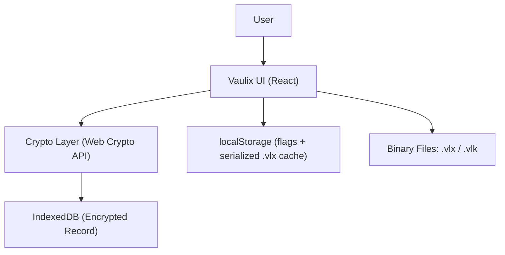
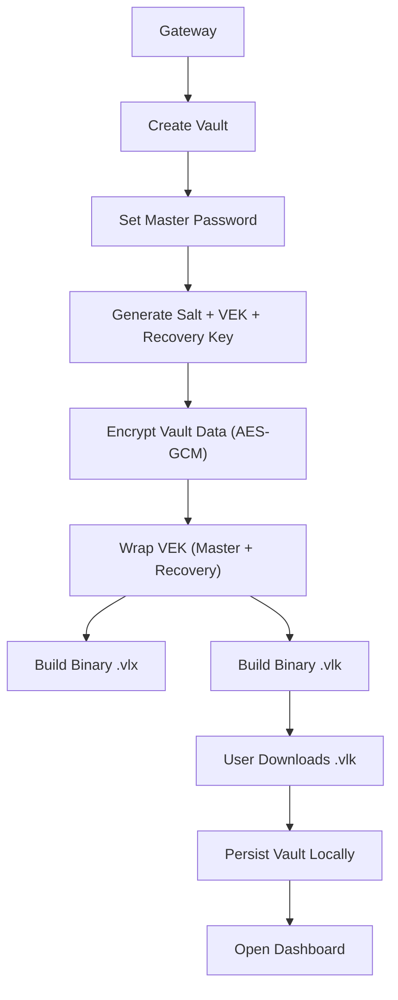
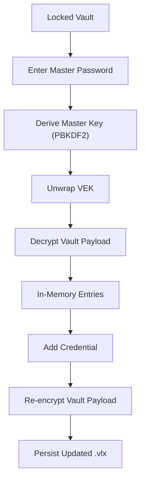
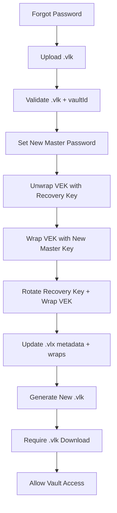
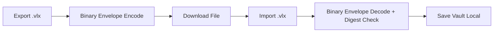
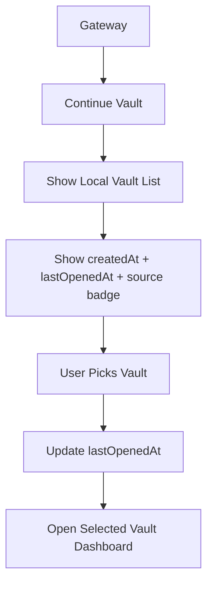
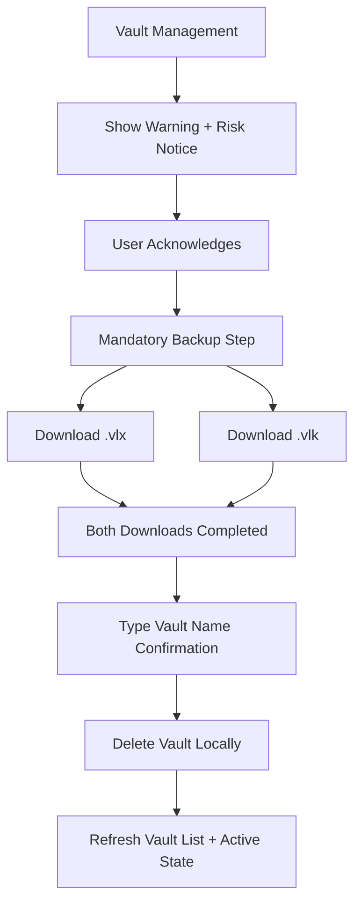

# Diagrams

Implementation-aligned architecture and flow diagrams.

## High-Level Runtime

## Vault Creation

## Unlock and Credential Add

## Forgot Password Reset (`.vlk`)

## Import / Export

## Multi-Vault Continue Flow

## In-Dashboard Vault Deletion Flow

